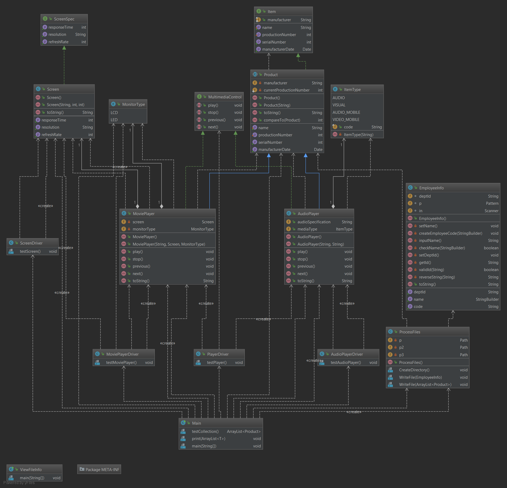

# JPProject
### Description
This was a project assigned in COP 3003 at Florida Gulf Coast University, in order to better my understanding of OOP (Object-Oriented Programming) and to demonstrate the proper uses of basic programming concepts.

##### Scenario:
OraclProduction Ltd are specialists in producing production line manufacturing plants.

They could be asked to create a production plant for any type of product ranging from a simple packaging system to a variety of electronic devices.

Recently they have been asked to create a production line for multimedia devices which include music and movie players. They wish to employee you to design a template in Java for creating and recording all future production line items. For this particular production facility you will only implement a concrete class for music and movie players.

Your task is to create a flexible structure that could be used in any production line. This structure would then allow easy modification to handle different products.

### This project includes :

[JavaDoc](https://Natt913.github.io/JPProject/javadoc/index.html)

#### Interfaces
In the Java programming language, an interface is a reference type, similar to a class, that can contain only constants, method signatures, default methods, static methods, and nested types. Method bodies exist only for default methods and static methods. Interfaces cannot be instantiated—they can only be implemented by classes or extended by other interfaces. Extension is discussed later in this lesson.

#### Enums
An enum type is a special data type that enables for a variable to be a set of predefined constants. The variable must be equal to one of the values that have been predefined for it. Common examples include compass directions (values of NORTH, SOUTH, EAST, and WEST) and the days of the week.

#### Final Keyword
You use the final keyword in a method declaration to indicate that the method cannot be overridden by subclasses. The Object class does this—a number of its methods are final.

#### Static Keyword
Fields that have the static modifier in their declaration are called static fields or class variables. They are associated with the class, rather than with any object. Every instance of the class shares a class variable, which is in one fixed location in memory. Any object can change the value of a class variable, but class variables can also be manipulated without creating an instance of the class.

#### Collections
The root interface in the collection hierarchy. A collection represents a group of objects, known as its elements. Some collections allow duplicate elements and others do not. Some are ordered and others unordered. The JDK does not provide any direct implementations of this interface: it provides implementations of more specific subinterfaces like Set and List. This interface is typically used to pass collections around and manipulate them where maximum generality is desired.

## Class Diagram

## Steps Completed
- [x] Step 1
- [x] Step 2
- [x] Step 3
- [x] Step 4
- [x] Step 5
- [x] Step 6
- [x] Step 7
- [x] Step 8
- [x] Step 9
- [x] Step 10
- [x] Step 11
- [x] Step 12
- [x] Step 13
- [x] Step 14
- [x] Step 15
- [x] Step 16
- [x] Step 17
- [x] Step 18
- [x] Step 19
- [x] Step 20
- [x] Step 21
- [x] Step 22
- [ ] Step 23

## Credits
- Oracle
- IntelliJ
- Profesor Vanselow (@profvanselow)
